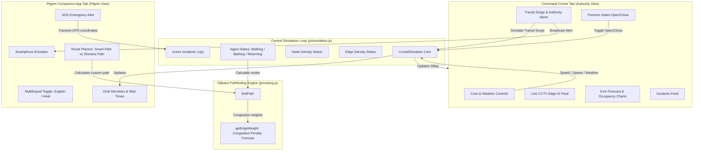
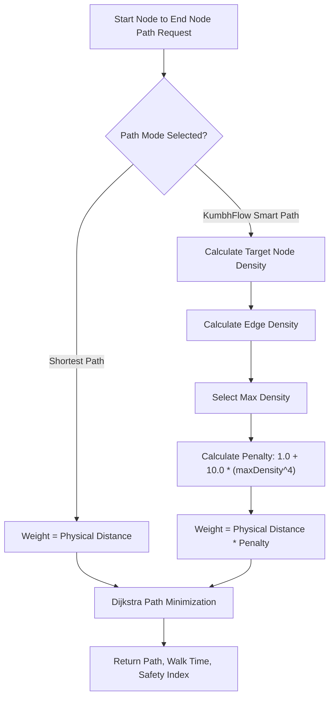

# KumbhFlow AI - Intelligent Crowd Management & Route Optimization

**KumbhFlow AI** is a premium agent-based simulation and safety-weighted pathfinding dashboard designed to optimize pilgrim transit flow, forecast congestion hotspots, and recommend dynamic routes for the **Prayagraj Mahakumbh Mela 2028** (the world's largest human gathering).

---

## 1. System Architecture

The following diagram illustrates how the system's components interact, from the central simulation engine to the front-end user interfaces:



---

## 2. Dynamic Congestion-Weighted Routing Algorithm

Standard routing algorithms direct travelers along the shortest path, leading to severe bottlenecks and stampede risks during massive surges. **KumbhFlow AI** implements a **Congestion-Weighted Dijkstra Algorithm** that exponentially penalizes paths as their crowd densities increase.



### Congestion Penalty Formula
$$\text{Weight} = \text{Distance} \times \left(1.0 + 10.0 \times \text{Density}^4\right)$$

*   At **$\le 40\%$ density**, the penalty is negligible ($\approx 1.02x$).
*   At **$80\%$ density**, the penalty escalates ($\approx 5.1x$), routing pilgrims to longer but safer alternative pathways.
*   At **$100\%$ capacity**, the weight multiplier reaches **$11.0x$**, effectively sealing off high-risk pathways.

---

## 3. Network Topology

### Mela Infrastructure Nodes (Junctions, Gates, Landmarks)

| Node ID | Node Name | Type | Capacity (Pilgrims) | Description |
| :--- | :--- | :--- | :--- | :--- |
| `junction_station` | Prayagraj Junction Station | Transport Hub | 150,000 | Main railway junction receiving out-of-state trains. |
| `rambagh_station` | Prayagraj Rambagh Station | Transport Hub | 80,000 | Secondary railway terminal closer to Mela boundary. |
| `naini_parking` | Naini Parking Lot (South) | Transport Hub | 60,000 | Primary southern transit parking and shuttle depot. |
| `jhalwa_parking` | Jhalwa Parking Lot (West) | Transport Hub | 80,000 | Western transit parking, feeding pilgrims via Sector 1. |
| `entry_gate_a` | Mela Entry Gate A (Sector 1) | Mela Gate | 50,000 | Northern entry gate controlling pilgrim flow from Rambagh. |
| `entry_gate_b` | Mela Entry Gate B (Sector 2) | Mela Gate | 50,000 | Northeastern entrance from rural bypasses. |
| `checkpoint_alpha` | Sector 3 Checkpoint (Kali Marg) | Checkpoint | 35,000 | Central junction control point managing flows to Fort road. |
| `checkpoint_beta` | Sector 4 Checkpoint (Triveni Marg) | Checkpoint | 35,000 | Primary bridge checkpoint feeding Northern Pontoon Bridges. |
| `fort_road_junction` | Qila Junction Point | Checkpoint | 40,000 | Strategic intersection beside Prayagraj Fort walls. |
| `hanuman_temple` | Bade Hanuman Ji Temple | Temple | 25,000 | High congestion landmark. Famous reclining Hanuman idol. |
| `akshayavat` | Akshayavat Sacred Tree (Fort) | Temple | 15,000 | Historical sacred fig tree located inside Prayagraj Fort. |
| `qila_ghat` | Qila Bathing Ghat | Bathing Ghat | 40,000 | Spacious stone ghat adjacent to the Akbar Fort walls. |
| `saraswati_ghat` | Saraswati Ghat (Yamuna Bank) | Bathing Ghat | 30,000 | Picturesque terraced ghat step on the banks of Yamuna river. |
| `pontoon_bridge_1` | Pontoon Bridge 1 (Ganges East) | Pontoon Bridge | 15,000 | Northern floating pontoon crossing. Heavy pedestrian density. |
| `pontoon_bridge_2` | Pontoon Bridge 2 (Ganges Central) | Pontoon Bridge | 15,000 | Central crossing. High priority queueing and bottlenecks. |
| `pontoon_bridge_3` | Pontoon Bridge 3 (Yamuna South) | Pontoon Bridge | 18,000 | Floating bridge connecting Arail/Naini sectors to Fort area. |
| `shastri_bridge` | Shastri Road Bridge | Road Bridge | 100,000 | Vehicular bridge over Ganges, pedestrian path open. |
| `sangam_entrance` | Triveni Sangam Bathing Area | Bathing Ghat | 200,000 | The sacred confluence of Ganga, Yamuna, and Saraswati. |
| `sector_5_ghat` | Sector 5 Ghat (Sachan Bank) | Bathing Ghat | 60,000 | Alternative bathing ghat on the eastern bank of Ganges. |

### Pathway Edges (Transit Connections)

| Origin Node | Destination Node | Physical Distance (m) | Type / Status |
| :--- | :--- | :--- | :--- |
| `junction_station` | `jhalwa_parking` | 2200 | Road (Open) |
| `junction_station` | `rambagh_station` | 2500 | Road (Open) |
| `jhalwa_parking` | `entry_gate_a` | 4000 | Highway Path (Open) |
| `junction_station` | `entry_gate_a` | 3500 | Highway Path (Open) |
| `rambagh_station` | `entry_gate_a` | 1200 | Pathway Segment (Open) |
| `rambagh_station` | `entry_gate_b` | 1900 | Pathway Segment (Open) |
| `entry_gate_a` | `checkpoint_alpha` | 900 | Security Lane (Open) |
| `entry_gate_b` | `checkpoint_beta` | 1100 | Security Lane (Open) |
| `checkpoint_alpha` | `fort_road_junction` | 800 | Critical Pathway (Open) |
| `checkpoint_alpha` | `checkpoint_beta` | 1300 | Connecting Road (Open) |
| `checkpoint_beta` | `pontoon_bridge_1` | 950 | Bridge Approach (Open) |
| `checkpoint_beta` | `hanuman_temple` | 600 | High-density Lane (Open) |
| `fort_road_junction` | `saraswati_ghat` | 1100 | Ghat Pathway (Open) |
| `fort_road_junction` | `akshayavat` | 550 | Fort Lane (Open) |
| `fort_road_junction` | `hanuman_temple` | 700 | Fort Lane (Open) |
| `akshayavat` | `qila_ghat` | 350 | Local Pathway (Open) |
| `hanuman_temple` | `qila_ghat` | 650 | Connecting Path (Open) |
| `hanuman_temple` | `pontoon_bridge_2` | 500 | Bridge Approach (Open) |
| `qila_ghat` | `pontoon_bridge_3` | 750 | Bridge Approach (Open) |
| `naini_parking` | `pontoon_bridge_3` | 1200 | Southern Shuttle Link (Open) |
| `pontoon_bridge_1` | `sector_5_ghat` | 850 | Floating Pontoon Bridge (Dynamic) |
| `pontoon_bridge_2` | `sangam_entrance` | 450 | Floating Pontoon Bridge (Dynamic) |
| `pontoon_bridge_3` | `sangam_entrance` | 1000 | Floating Pontoon Bridge (Dynamic) |
| `sector_5_ghat` | `sangam_entrance` | 950 | Sand Pathway (Open) |
| `entry_gate_b` | `shastri_bridge` | 1800 | Bridge Bypass (Open) |
| `shastri_bridge` | `sector_5_ghat` | 2200 | Bridge Bypass (Open) |

---

## 4. Local Setup and Deployment

1.  **Clone the Repository**:
    ```bash
    git clone https://github.com/akarsh957/KumbhFlow-AI.git
    cd KumbhFlow-AI
    ```

2.  **Start a Local Web Server**:
    Since the application uses ES6 modules, it must be run from a local server context (not directly by double-clicking `index.html`).
    
    Using Node.js (`npx`):
    ```bash
    npx http-server -p 8081
    ```
    
    Or using Python:
    ```bash
    python -m http.server 8081
    ```

3.  **Access the Dashboard**:
    Open your browser and navigate to **`http://localhost:8081`**.
